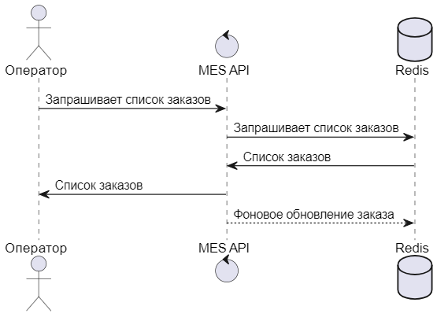
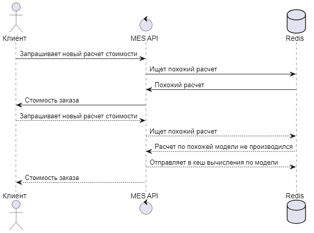

# Архитектурное решение по кешированию

В данный момент есть две проблемы которые можно решить кешированием:
- операторы MES системы сообщают о долгой загрузке страницы заказов и долгом поиске по заказам
- очень ресурсозатратная операция расчета стоимости заказа

## Мотивация

Кеширование списка заказов позволит операторам быстрее находить и обрабатывать интересующие их заказы.

Кеширование данных о расчетах стоимости позволит ускорить процесс обработки заказа и сократить траты на ресурсы которые требуются для расчета стоимости. 

Так как за выдачу и поиск заказов и за расчет стоимости отвечает система MES API, то кеширование необходимо внедрить в первую очередь именно для этой системы.

## Предлагаемое решение

В данной ситуации предлагается внедрить серверное  кеширование для сервиса MES API.
Это позволит гибко управлять временем жизни кеша и предоставит возможность точечного обновления кеша.

Так как необходимо ускорить работу со списком заказов, под разные запросы от операторов - для этой задачи подходит больше серверное кеширование.

Для кеширования данных для определения стоимости заказа подойдет паттерн Cache-Aside, он позволит достаточно просто настроить кеширование расчетов.
Тут возможно время жизни этих кешированных данных можно сделать очень большим и проигнорировать сценарий инвалидации данных, так как данные при расчете для похожих моделей можно переиспользовать постоянно, а конечная цена будет просто результатом вычисления по уже готовым данным похожих моделей и текущей стоимости производства.

Для кеширования списка заказов Refresh-Ahead это позволит асинхронно обновлять кеш как только по какой-то из заказов изменит свое состояние.
Для этих данных подойдет инвалидация по ключу, позволит точечно обновлять кеш по конкретному заказу. Другие варианты обновления кеша при паттерне Refresh-Ahead будут давать большую нагрузку на пересчет кеша по всему списку заказов, что не требуется. Например заказы после того как они завершены больше не требуется обновлять в кеше, а их может быть очень много.

